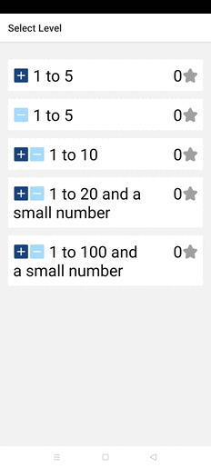

# CleverApes Math

Very simple app for children to practice basic arithmetic.

It has been written using https://expo.io/, which is a [React Native](https://reactnative.dev/) framework and platform.

## Screencast

## Math levels

All the levels are defined in [math-levels.js](lib/math-levels.js).